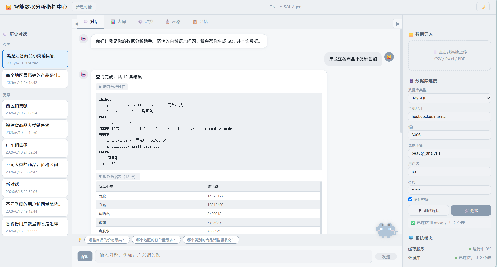
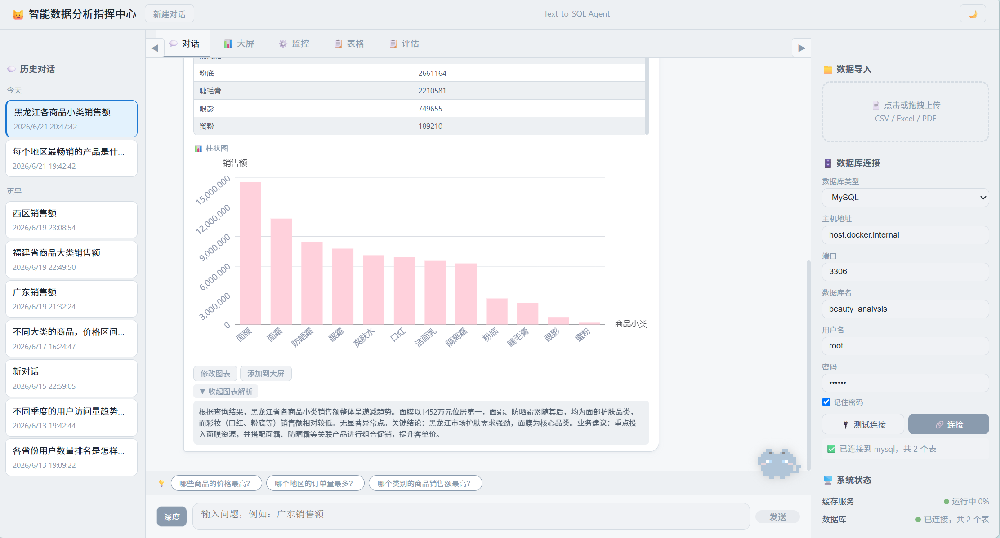

# Text-to-SQL Agent 🤖

> **企业级智能数据分析 Agent** — 基于 LangGraph 的多 Agent 协作 · 物理安全护栏 · Self-Correction · 莫兰迪 UI

[](https://docker.com)
[](https://fastapi.tiangolo.com)
[](https://python.org)
[](LICENSE)

---

## 📋 目录

- [项目概述](#项目概述)
- [系统架构](#系统架构)
- [核心组件](#核心组件)
- [安全体系](#安全体系)
- [工作流程](#工作流程)
- [快速开始](#快速开始)
- [配置说明](#配置说明)
- [API 文档](#api-文档)
- [项目结构](#项目结构)

---

## 项目概述

**Text-to-SQL Agent** 是一个企业级智能数据分析系统，将用户自然语言问题转化为 SQL 查询。基于 LangGraph 多 Agent 协作架构，全部推理通过云端 API（OpenAI 兼容）完成。



```
用户提问 → Router 分类 → Schema 检索 + FieldResolver → SQL 生成 → Critic 校验 → SQLGuard 拦截 → 执行 → 可视化
```

### 核心能力

| 能力 | 说明 |
|------|------|
| 🗣️ 自然语言 → SQL | 支持中文口语化提问，"广东卖了多少？" → 生成精确 SELECT |
| 🤖 多 Agent 协作 | Router → Generator → Critic → Executor，LangGraph 状态图编排 |
| 🔄 多轮对话 | ConversationManager 自动补全追问（"那江苏呢？"→ `WHERE province='江苏'`） |
| 🛡️ SQLGuard 物理拦截 | DDL/DML 写操作在代码层直接阻断，`startswith(('SELECT','WITH'))` 校验 |
| 🔒 管理接口认证 | `ADMIN_TOKEN` SHA256 验证，未配置仅允许本地访问 |
| ⏱️ 速率限制 | `/api/chat/stream` 每 IP 每秒 3 次，超限 429 |
| 🔄 Self-Correction | SQL 执行失败 → 自动分析 → Trace 检索 → 修正 → 重试（最多 2 次） |
| 🧩 零静态映射 | FieldResolver 三段式匹配（规则 90% → GLM 消歧 10%），废弃 `term_mappings.json` |
| 📚 Schema 自动加载 | 从 INFORMATION_SCHEMA 动态读取表/字段/注释/样本值 |
| ⚡ 两级语义缓存 | L1 MD5 精确匹配 + L2 jieba 词频向量语义缓存 |
| 📊 18 种可视化图表 | 柱状图、折线图、饼图、散点图、雷达图、桑基图等，支持一键刷新 |
| 💾 CSV/XLS/PNG 导出 | 查询结果导出，图表下载 |
| 🌙 暗色/亮色主题 | CSS 变量双主题，`localStorage` 持久化 |
| 🎨 莫兰迪 UI | 低饱和雾霾蓝配色、12px 大圆角、0.3s 平滑过渡 |

---

## 系统架构

```
┌──────────────────────────────────────────────────────────────────┐
│                     用户界面 (Web UI)                              │
│  莫兰迪主题 · 品牌首页 · 三栏布局 · 暗色/亮色切换 · 历史对话卡片    │
└──────────────────────────┬───────────────────────────────────────┘
                           │ HTTP / SSE（带速率限制 + 认证）
┌──────────────────────────▼───────────────────────────────────────┐
│                    FastAPI 服务层 (app.py)                          │
│  安全中间件 · ADMIN_TOKEN 校验 · CORS 限制 · 输入验证 · 健康检查    │
└──────────────────────────┬───────────────────────────────────────┘
                           │
┌──────────────────────────▼───────────────────────────────────────┐
│              LangGraph 状态图 (graph.py)                           │
│                                                                   │
│  ┌──────────┐    ┌───────────┐    ┌────────────┐  ┌───────────┐  │
│  │Context   │───→│Router     │───→│Schema      │─→│Generator  │  │
│  │Completion│    │Agent      │    │Retriever   │  │Agent      │  │
│  └──────────┘    └───┬───────┘    └────────────┘  └─────┬─────┘  │
│                      │chat/dangerous                     │        │
│                      ▼                                  ▼        │
│              ┌──────────────┐                    ┌────────────┐   │
│              │ 直返/拒绝     │                    │Critic Agent│   │
│              │              │     ◄───无效───────│+ Trace检索 │   │
│              └──────────────┘                    └─────┬──────┘   │
│                                                        │有效     │
│                                                        ▼         │
│  ┌──────────┐    ┌──────────┐    ┌──────────────────┐            │
│  │缓存写入   │◄───│Executor  │◄───│SQLGuard          │            │
│  │+上下文保存│    │Agent     │    │物理安全拦截       │            │
│  └──────────┘    └──────────┘    └──────────────────┘            │
└──────────────────────────┬───────────────────────────────────────┘
                           │
┌──────────────────────────▼───────────────────────────────────────┐
│                    数据层                                           │
│  MySQL / PostgreSQL / SQLite · Redis (缓存)                       │
└──────────────────────────────────────────────────────────────────┘
```

---

## 核心组件

### 1. 多 Agent 协作 (agents/)

| Agent | 模型 | 职责 |
|-------|------|------|
| RouterAgent | GLM-4-Flash | 用户意图三分类：query/chat/dangerous |
| SchemaRetriever | GLM-4-Flash | Schema 检索、FieldResolver 字段/值解析、Reranker 精排 |
| GeneratorAgent | DeepSeek-v4-Flash | SQL 生成（零静态映射，完全 Schema 驱动） |
| CriticAgent | GLM-4-Flash | SQL 语法校验 + Trace 检索 + Self-Correction 闭环 |
| ExecutorAgent | — | SQLGuard 拦截 + 只读事务执行 + SQL 优化 |
| ConversationManager | GLM-4-Flash | 多轮对话追问补全、上下文提取、历史维护 |

### 2. LangGraph 状态图 (graph.py)

```
context_completion → router → (chat|dangerous|query)
query → check_cache → retrieve_schema → generator → critic
critic → (valid → executor | invalid → generator [retry])
executor → write_cache → save_context → END
```

### 3. FieldResolver — 零静态映射 (agents/schema_retriever.py)

```
resolve_field("销售额", "orders")
  ├── KV 缓存命中 → 直接返回
  ├── 规则匹配（字段名/注释/样本值）→ 90% 零 Token
  └── GLM-4-Flash 消歧 → 写入缓存 → 下次免调
```

### 4. SQLGuard 安全体系 (harness/sql_guard.py + app.py)

| 层级 | 机制 |
|------|------|
| 输入验证 | Pydantic validator：问题 ≤500 字符、过滤危险字符、DB 参数防注入 |
| 速率限制 | `/api/chat/stream` 每 IP 3 req/s，超限 429 |
| 管理认证 | `ADMIN_TOKEN` SHA256，未配置仅本地 `127.0.0.1` |
| SQL 拦截 | `startswith(('SELECT','WITH'))` + DDL/DML 黑名单正则审计日志 |

### 5. Self-Correction 闭环 (agents/critic_agent.py)

```
SQL 执行失败 → search_similar_trace() → 检索 tracess/ 历史修正
  → 构建增强 Prompt（含历史修正提示）→ Generator 修正 → 重试
  → 成功 → 记录 Trace
  → 失败（2 次后）→ 返回友好提示 + 记录 Trace
```

### 6. 多轮对话 (agents/conversation_manager.py)

```
第1轮: "广东销售额" → 正常查询
第2轮: "那江苏呢？" → 补全为"查询江苏省的销售额" → WHERE province='江苏'
第3轮: "按地区分一下" → 补全为"按地区分组统计销售额" → GROUP BY province
```

### 7. 两级语义缓存 (core/cache.py)

- **L1 精确缓存**：MD5 哈希匹配
- **L2 语义缓存**：jieba 词频向量余弦相似度 > 0.9
- 缓存后端：Redis / fakeredis

### 8. 可视化系统

18 种图表类型 × 21 种配色风格，大屏采用 **3 列 GridLayout** 深色底板布局：顶部 KPI 指标栏横向排列单值指标，图表区自动填充无滚动。支持统一主题切换（预览→保存/恢复）、容器透明度调节、单图表配色独立于全局主题。图表卡片无边框扁平化设计，操作按钮悬停显示，支持拖拽吸附与缩放。全屏模式下自适应容器尺寸。



---

## 安全体系

| 措施 | 实现 |
|------|------|
| 管理接口认证 | `api/auth.py` — `ADMIN_TOKEN` SHA256，未配置仅允许本地 |
| 速率限制 | `/api/chat/stream` 每 IP 每秒 3 次，超限 429 |
| CORS | 仅允许 `GET, POST, DELETE, OPTIONS` 方法 |
| 输入验证 | 问题 ≤500 字符，过滤 `\x00-\x1f`，DB 参数防 `;`/`--`/`DROP` |
| SQL 拦截 | `sql.strip().upper().startswith(('SELECT','WITH'))` + 黑名单 |
| 健康检查 | `/health` 返回 `{"status": "ok"}` |
| 日志轮转 | Docker `json-file` 驱动，`max-size: 10m`, `max-file: 3` |

---

## 工作流程

```
用户: "广东省销售额"
  │
  ├── ConversationManager: 第一轮，无需补全
  │
  ├── RouterAgent: {"intent": "query", "reason": "查询广东销售数据"}
  │
  ├── Cache检查: 未命中
  │
  ├── SchemaRetriever: search → rerank → Top-3表结构
  │    每字段含注释 + 样本值（e.g. 广东, 江苏）
  │
  ├── GeneratorAgent（禁止别名的严格 Prompt）
  │    SELECT SUM(amount) FROM `orders` WHERE `province` = '广东'
  │
  ├── CriticAgent: sqlglot语法检查 + 字段存在性校验 ✓
  │
  ├── SQLGuard: startswith('SELECT') ✓  黑名单无匹配 ✓
  │
  ├── ExecutorAgent: 只读事务执行 → 返回数据
  │
  ├── 结果 → 自动图表推荐 + CSV/XLS 导出
  │
  └── save_context: 更新历史 → 下一轮追问可用
```

---

## 快速开始

### 前置条件

- Docker & Docker Compose（推荐）
- 或 Python 3.12+
- OpenAI 兼容的 API（阿里云 DashScope / DeepSeek / 智谱 GLM）

### Docker 部署

```bash
git clone https://github.com/lch-111/text2sql-agent.git
cd text2sql-agent
cp .env.example .env
# 编辑 .env，填入 API Key 和数据库配置
docker compose up -d
# http://localhost:8000
```

### 本地运行

```bash
python -m venv .venv
source .venv/bin/activate
pip install -r requirements.txt
cp .env.example .env
uvicorn app:app --host 0.0.0.0 --port 8000
```

### API 调用

```python
from agent import TextToSQLAgent
agent = TextToSQLAgent()
result = agent.generate_and_execute("广东省销售额")
print(result["sql"])    # SELECT SUM(amount) FROM `orders` WHERE `province` = '广东'
print(result["result"]) # [{"total_sales": 3347000}]
```

---

## 配置说明

### 环境变量 (`.env`)

| 变量 | 默认值 | 说明 |
|------|--------|------|
| `OPENAI_API_KEY` | - | DeepSeek 模型 API Key（阿里云百炼） |
| `OPENAI_BASE_URL` | - | API 地址 |
| `GLM_API_KEY` | - | GLM 模型 API Key（智谱 AI） |
| `GLM_BASE_URL` | `https://open.bigmodel.cn/api/paas/v4` | GLM API 地址 |
| `ROUTER_MODEL` | `glm-4-flash` | 路由/分类模型（免费） |
| `GENERATOR_MODEL` | `deepseek-v4-flash` | SQL 生成模型 |
| `CRITIC_MODEL` | `glm-4-flash` | SQL 校验模型（免费） |
| `RERANKER_MODEL` | `glm-4-flash` | Schema 精排模型（免费） |
| `ADMIN_TOKEN` | - | 管理令牌（SHA256，空=仅本地访问） |
| `DB_TYPE` | `sqlite` | 数据库类型 |
| `LOG_LEVEL` | `INFO` | 日志级别 |

---

## API 文档

### 流式聊天

```http
POST /api/chat/stream
Content-Type: application/json
Authorization: Bearer <admin-token>  # 管理接口需要

{"question": "广东省销售额"}
```

SSE 事件流：
```
event: step    → {"step":"cache_check","message":"检查缓存中..."}
event: step    → {"step":"generating","message":"AI 正在生成 SQL..."}
event: sql     → {"sql":"SELECT SUM(amount) FROM `orders` WHERE `province` = '广东'"}
event: result  → {"result":[...],"columns":[...],"conversation_history":[...]}
event: done    → {}
```

### 管理接口

| 接口 | 方法 | 说明 | 需认证 |
|------|------|------|--------|
| `/health` | GET | 健康检查 | 否 |
| `/api/chat/stream` | POST | 流式聊天 | 否（速率限制 3/s） |
| `/api/db/status` | GET | 数据库状态 | 是 |
| `/api/db/connect` | POST | 连接数据库 | 是 |
| `/api/cache/clear` | POST | 清空缓存 | 是 |
| `/api/eval/report` | GET | 评估报告 | 是 |

---

## 项目结构

```
text2sql-agent/
├── app.py                  # FastAPI 入口（安全中间件、CORS、速率限制）
├── graph.py                # LangGraph 状态图编排
├── agent.py                # 兼容层（委托给 graph.py）
│
├── core/                   # 基础设施
│   ├── cache.py            # L1+L2 两级语义缓存
│   ├── config.py           # 全局配置
│   ├── database.py         # 数据库适配层
│   ├── llm_client.py       # LLM 客户端封装
│   ├── hybrid_search.py    # BM25 + 向量混合检索
│   └── vector_store.py     # TF-IDF 向量存储
│
├── services/               # 业务服务
│   ├── sql_optimizer.py    # SQL 优化分析
│   ├── sql_validator.py    # sqlglot 语法校验
│   ├── file_processor.py   # 文件解析
│   └── evaluator.py        # 自动化评估
│
├── agents/                 # 多 Agent 协作
│   ├── router_agent.py     # 意图分类
│   ├── schema_retriever.py # Schema 检索 + FieldResolver
│   ├── generator_agent.py  # SQL 生成（零静态映射）
│   ├── critic_agent.py     # SQL 校验 + Self-Correction + Trace 检索
│   ├── executor_agent.py   # SQL 安全执行器
│   └── conversation_manager.py # 多轮对话补全
│
├── harness/                # 安全护栏
│   └── sql_guard.py        # SQLGuard 物理安全拦截
│
├── api/
│   ├── auth.py             # ADMIN_TOKEN 认证中间件
│   ├── routes.py           # API 路由
│   ├── schemas.py          # Pydantic 模型 + 输入验证
│   └── streaming.py        # SSE 流式聊天（线程池 + 心跳）
│
├── static/                 # 前端（莫兰迪 UI）
│   ├── css/style.css       # 主样式表（亮/暗双主题）
│   └── js/ (chat.js, app.js, charts.js, utils.js)
│
├── templates/
│   └── index.html          # 品牌首页 + 三栏工作台
│
├── traces/                 # 错题本
├── data/
└── harness/               # AI 驾驶舱规则
```

---

## 关键技术决策

| 决策 | 选择 | 理由 |
|------|------|------|
| Agent 编排 | LangGraph StateGraph | 有向图天然适合条件分支和循环 |
| API 协议 | OpenAI 兼容 | 可切换任意 OpenAI 兼容 API |
| 字段映射 | FieldResolver 三段式 | 90% 零 Token，完全动态，换库无感 |
| 安全拦截 | SQLGuard + 中间件 | 不可绕过，审计日志独立存储 |
| UI 主题 | CSS 变量双主题 | Geist 字体、莫兰迪配色、0.3s 过渡 |
| 缓存 | Redis + 语义向量 | 同类问题自动复用 |
| 图表引擎 | ECharts | 18 种图表类型，一键刷新 |

---

## 许可证

MIT License

---

*本项目展示了 Text-to-SQL、多 Agent 协作（LangGraph）、物理安全拦截（SQLGuard）、Self-Correction 闭环、莫兰迪 UI 设计等完整企业级技术栈。*
